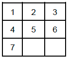

# A* on the 7-tile Puzzle

## Summary

Solving a variant of the 8-tile puzzle. The 8-tile puzzle was invented and
popularized by Noyes Palmer Chapman in the 1870s. This version is
played on a 3x3 grid with 7 tiles labeled 1 through 7 and two empty grids. The goal is to rearrange the
tiles so that they are in order and the empty places are at the bottom right.

You solve the puzzle by moving the tiles around. For each step, you can only move one (not more!)
of the neighbor tiles ( left, right, top, bottom butnot diagonally ) into an empty grid. And all tilesmust
stay in the 3x3 grid (so no wrap around allowed). An example is shown in the picture below. Suppose
we start from the following configuration:


Then, moving one tile can result in one of the following:


That is, in the above example, we would either move 3 or 6 down or move 7 to the right. 

## Program Specification
### Goal State


The goal state of the puzzle is [1, 2, 3, 4, 5, 6, 7, 0, 0], or visually:




### Heuristic


Since we are using the A* search algorithm, we need a heuristic functionh(s). 
We will use the sum of Manhattan distance of each tile to
its goal position as our heuristic function. The Manhattan distance of two tiles in this case is the
absolute difference between their x coordinates plus the absolute distance between their y
coordinates.

In our first example puzzle 
```python
([2,5,1,4,3,6,7,0,0])
```
the h()is 6. This is computed by calculating
the Manhattan distance of each title and summing them. Specifically, tiles 4/6/7 are already in place,
thus they have 0 distances. Tile 1 has a Manhattan distance of 2 (manhattan([0,2], [0,0]) = abs(0-0) +
abs(2-0) = 2), tiles 2/3/5 have distances of 1/2/1, respectively.

### Functions

1. *print_succ(state)* — given a state of the puzzle, representedas a single list of integers
    with a 0 in the empty spaces, print to the console all of the possible successor states.
2. *solve(state)* — given a state of the puzzle, performthe A* search algorithm and print the
    path from the current state to the goal state.

### Print Successors

This function prints out the successor states of the initial state, as well as their heuristic value
according to the function described above. The number of successor states depends on the current
state.
```python
    >>> print_succ([2,5,1,4,0,6,7,0,3])
    [2, 0, 1, 4, 5, 6, 7, 0, 3] h=5
    [2, 5, 1, 0, 4, 6, 7, 0, 3] h=7
    [2, 5, 1, 4, 0, 6, 0, 7, 3] h=7
    [2, 5, 1, 4, 0, 6, 7, 3, 0] h=7
    [2, 5, 1, 4, 6, 0, 7, 0, 3] h=7
```

They are printed in a specific orde r: if you consider the state to be a nine-digit
integer, the states should be sorted in ascending order. Conveniently, if you ask Python to sort
one-dimensional arrays, it will adhere to this order by default. For example:


```python
>>> lists = [[2, 0, 1, 4, 5, 6, 7, 0, 3],
[2, 5, 1, 4, 6, 0, 7, 0, 3]
[2, 5, 1, 4, 0, 6, 7, 3, 0],
[2, 5, 1, 4, 0, 6, 0, 7, 3],
[2, 5, 1, 0, 4, 6, 7, 0, 3]]
>>> sorted(lists)
[[2, 0, 1, 4, 5, 6, 7, 0, 3], [2, 5, 1, 0, 4, 6, 7, 0, 3], [2, 5, 1, 4, 0, 6,
0, 7, 3], [2, 5, 1, 4, 0, 6, 7, 3, 0], [2, 5, 1, 4, 6, 0, 7, 0, 3]]
```

### Priority Queue

The PQ will push an item([1, 2, 3, 4, 5, 0, 6, 7, 0], (0, 5, -1)) with priority 5 into
the queue. It would be useful to do pushes of the form

```python
heapq.heappush(pq ,(cost, state, (g, h, parent_index)))
```

where pq is the priority queue, g and h are the values of the functions that we defined in Search II
slides (g is the cost from the starting node, which in our case will be the number of moves so far, and h
is the value of the heuristic function) and cost=g+h (this is what we want to use as priority). A parent
index of -1 denotes the initial state, without any parent. 

To get the final path, for each element in the priority queue we need to remember its parent state.
Remember to store the state when you pop it from the priority queue, so you could refer to it later when
you generate the final path. Here is how you can pop from a priority queue

```python
>>> b = heapq.heappop(pq)
>>> print(b)
(5, [1, 2, 3, 4, 5, 0, 6, 7, 0], (0, 5, -1))
>>> print(pq)
[]
```


Note that the heap push maintains the priority in ascending order, i.e., heappop will always pop the
element with the smallest priority. We require that the states with the same cost (priority) to be popped
in a specific order: if you consider the state to be a nine-digit integer, the states should be sorted in
ascending order - just like we mentioned above.

### Solve the Puzzle


This function should print the solution path from the provided initial state to the goal state, along with
the heuristic values of each intermediate state according to the function described above, and total
moves taken to reach the state. Recall that our cost function g(n) is the total number of moves so far,
and every valid successor has an additional cost of 1.

```
>>> solve([4,3,0,5,1,6,7,2,0])
[4, 3, 0, 5, 1, 6, 7, 2, 0] h=7 moves: 0
[4, 0, 3, 5, 1, 6, 7, 2, 0] h=6 moves: 1
[4, 1, 3, 5, 0, 6, 7, 2, 0] h=5 moves: 2
[4, 1, 3, 0, 5, 6, 7, 2, 0] h=4 moves: 3
[0, 1, 3, 4, 5, 6, 7, 2, 0] h=3 moves: 4
[0, 1, 3, 4, 5, 0, 7, 2, 6] h=4 moves: 5
[0, 1, 3, 4, 0, 5, 7, 2, 6] h=5 moves: 6
[0, 1, 3, 4, 2, 5, 7, 0, 6] h=4 moves: 7
[1, 0, 3, 4, 2, 5, 7, 0, 6] h=3 moves: 8
[1, 2, 3, 4, 0, 5, 7, 0, 6] h=2 moves: 9
[1, 2, 3, 4, 5, 0, 7, 0, 6] h=1 moves: 10
[1, 2, 3, 4, 5, 6, 7, 0, 0] h=0 moves: 11
Max queue length: 163
```